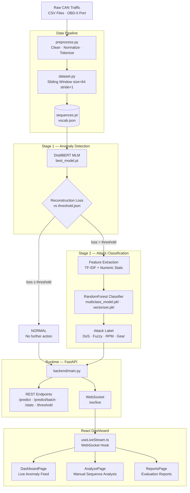

<div align="center">

# CAN Bus Intrusion Detection System

### *Transformer-Based Anomaly Detection & Attack Classification for In-Vehicle Networks*

> **"If a CAN bus speaks a language, a hacker speaks broken grammar."**  
> We teach a Transformer to learn that language — and catch every typo.

<br>

[](https://python.org)
[](https://pytorch.org)
[](https://huggingface.co)
[](https://scikit-learn.org)
[](https://fastapi.tiangolo.com)
[](https://react.dev)
[](https://typescriptlang.org)
[](LICENSE)

<br>

**[Overview](#-project-overview) · [Architecture](#-system-architecture--the-2-stage-pipeline) · [Requirements](#-hardware--software-requirements) · [Installation](#-installation--demo-execution-guide) · [Tech Stack](#-tech-stack) · [Quickstart](#-quickstart) · [API Reference](#-api-reference) · [Evaluation](#-evaluation--metrics)**

</div>

---

## Table of Contents

- [Why This Matters](#-why-this-matters)
- [Project Overview](#-project-overview)
- [System Architecture — The 2-Stage Pipeline](#-system-architecture--the-2-stage-pipeline)
  - [Stage 1: Anomaly Detection via Reconstruction Loss](#stage-1-anomaly-detection-via-reconstruction-loss)
  - [Stage 2: Multiclass Attack Classification](#stage-2-multiclass-attack-classification)
  - [Pipeline Diagram](#pipeline-diagram)
- [Hardware & Software Requirements](#-hardware--software-requirements)
- [Installation & Demo Execution Guide](#-installation--demo-execution-guide)
- [Tech Stack](#-tech-stack)
- [Repository Structure](#-repository-structure)
- [Data Pipeline](#-data-pipeline)
- [Model Pipeline](#-model-pipeline)
- [Evaluation & Metrics](#-evaluation--metrics)
- [Quickstart](#-quickstart)
- [Full Execution Workflow](#-full-execution-workflow)
- [API Reference](#-api-reference)
- [Frontend Dashboard](#-frontend-dashboard)
- [License](#-license)
- [Acknowledgments & Citation](#-acknowledgments--citation)

---

## Why This Matters

Modern vehicles are rolling networks. Every time you brake, accelerate, or turn the wheel, dozens of **Electronic Control Units (ECUs)** exchange thousands of messages per second over the **Controller Area Network (CAN) bus** — a protocol designed in 1986 that ships with:

- No message authentication
- No sender verification
- No encryption of any kind

A single compromised ECU, a malicious OBD-II dongle, or a rogue Bluetooth module gives an attacker **unrestricted write access** to safety-critical systems including brakes, steering, throttle, and transmission. High-profile demonstrations by Miller & Valasek (Jeep Cherokee, 2015) proved this is not theoretical — they remotely disabled brakes and took control of steering at highway speed.

**This project builds a production-grade, real-time IDS that requires zero labeled attack data during training** — learning only what "normal" looks like, and flagging everything that deviates. When an anomaly is confirmed, a second-stage classifier identifies the exact attack type with fine-grained accuracy.

---

## Project Overview

This repository implements a **two-stage AI pipeline** for CAN bus intrusion detection:

| Stage | Task | Model | Trigger |
|:------|:-----|:------|:--------|
| **Stage 1** | Binary: Normal vs. Attack | DistilBERT (MLM, reconstruction loss) | Always runs on every window |
| **Stage 2** | Multiclass: Exact attack type | RandomForest + TF-IDF + numeric features | Only when Stage 1 flags ATTACK |

The system is served through a **FastAPI backend** with REST and WebSocket endpoints, and visualized in a **React + TypeScript SOC-style dashboard** with live stream monitoring, manual sequence analysis, and downloadable evaluation reports.

The entire approach is grounded in a linguistic analogy:

| NLP Concept | CAN Bus Equivalent |
|:------------|:-------------------|
| Word | CAN ID (hex → integer token) |
| Sentence | Sequence of CAN frames (window = 64) |
| Vocabulary | All unique CAN IDs observed in normal traffic |
| Grammar | Temporal ordering patterns of CAN IDs |
| Anomaly | Frame sequence that violates the learned grammar |

The model **never sees attack data during training**. It learns the statistical "language" of a healthy CAN bus through Masked Language Modeling. Attack frames — with injected, out-of-distribution IDs — produce high reconstruction loss because the model has never learned to predict them.

---

## System Architecture — The 2-Stage Pipeline

### Stage 1: Anomaly Detection via Reconstruction Loss

DistilBERT is fine-tuned on **normal CAN traffic only** using a Masked Language Modeling objective — randomly masking 15% of CAN ID tokens in each window and training the model to predict them from context.

At inference time:
1. A sliding window (size = 64, stride = 1) segments incoming CAN traffic into overlapping sequences
2. Each sequence passes through the trained model
3. **Cross-entropy reconstruction loss** is computed per sequence
4. If `loss > threshold` (the 99th percentile of normal traffic losses, stored in `threshold.json`) → flagged as **ATTACK**

This approach is entirely **unsupervised with respect to attack types** — it is inherently robust to zero-day attack variants never seen during training.

### Stage 2: Multiclass Attack Classification

When Stage 1 confirms an anomaly, Stage 2 activates:

1. The flagged sequence is featurized using:
   - **TF-IDF** over the string representation of the CAN ID sequence
   - **Numeric statistical features** (mean, variance, entropy of token distribution, unique token count)
2. A **RandomForest classifier** predicts one of four attack types:

| Label | Attack Description |
|:------|:-------------------|
| `DoS` | High-priority frame flooding to starve legitimate messages off the bus |
| `Fuzzy` | Injection of random/spoofed CAN IDs and data payloads |
| `RPM` | Forging engine RPM sensor messages to manipulate driver perception |
| `Gear` | Forging transmission gear position messages |

Stage 2 **only triggers on confirmed anomalies** — keeping inference overhead negligible on normal traffic.

### Pipeline Diagram



---

## Hardware & Software Requirements

### Hardware

| Component | Minimum Requirement | Recommended for Training |
|:----------|:--------------------|:-------------------------|
| RAM | 8 GB | 16 GB+ |
| CPU | 64-bit dual-core processor (Intel Core i5 / AMD Ryzen 5 class or equivalent) | 4+ cores for faster preprocessing/training |
| Storage | 10 GB free space | 20 GB+ free space for datasets, models, and reports |
| GPU | Not required for simulated demo inference | NVIDIA GPU with CUDA support (recommended for Stage 1 training) |

The simulated demo and API inference can run on CPU-only laptops. A CUDA-capable GPU is recommended for model training speed, but it is not strictly required to run the demo.

### Software

| Software | Required Version | Purpose |
|:---------|:-----------------|:--------|
| Python | 3.10+ | Backend and ML scripts |
| Node.js | 18+ | Frontend build and dev server |
| npm | 9+ | Frontend dependency management |
| Git | Any modern version (2.30+) | Clone and version control |
| Package managers | `pip` and `npm` | Install backend/frontend dependencies |

---

## Installation & Demo Execution Guide

Use the following steps on a fresh PC/laptop to install and run the demo.

### Step 1: Clone the repository

```bash
git clone https://github.com/<your-username>/can_bus_ids_project.git
cd can_bus_ids_project
```

### Step 2: Backend setup (Python virtual environment + dependencies)

```powershell
py -3 -m venv venv

# Windows PowerShell
.\venv\Scripts\Activate.ps1

python -m pip install --upgrade pip
pip install -r requirements.txt
```

Optional configuration: if your model/data paths differ from defaults, create a root `.env` file and override variables such as `MODEL_PATH`, `THRESHOLD_PATH`, `VOCAB_PATH`, and `PORT`.

### Step 3: Frontend setup (React + Vite)

```bash
cd frontend
npm install
cd ..
```

### Step 4: Run the demo (two terminals)

Terminal 1 (backend FastAPI server):

```bash
python -m uvicorn backend.main:app --host 0.0.0.0 --port 8000
```

Terminal 2 (frontend Vite dev server):

```bash
cd frontend
npm run dev
```

Then open `http://localhost:3000` in your browser.

---

## Tech Stack

### Machine Learning & Data Science

| Library | Version | Role |
|:--------|:--------|:-----|
| **PyTorch** | 2.x | Deep learning framework for Stage 1 training and inference |
| **Hugging Face Transformers** | latest | DistilBERT model, tokenizer, and MLM training utilities |
| **scikit-learn** | latest | Stage 2 RandomForest classifier, TF-IDF vectorizer, evaluation metrics |
| **pandas** | latest | Data loading, cleaning, and manipulation of raw CAN CSV datasets |
| **NumPy** | latest | Numerical operations, threshold computation, sequence statistics |
| **SciPy** | latest | Statistical analysis for threshold percentile calibration |
| **Matplotlib / Seaborn / Plotly** | latest | Loss distribution plots, confusion matrices, ROC curves |

### ⚙️ Backend

| Library | Role |
|:--------|:-----|
| **FastAPI** | High-performance async REST API framework |
| **WebSockets** | Real-time bidirectional streaming via `/ws/live` |
| **pydantic-settings** | Environment-driven path and config management in `config.py` |
| **uvicorn** | ASGI server for production-grade async execution |

### Frontend

| Library | Role |
|:--------|:-----|
| **React 18** | Component-driven UI framework |
| **TypeScript** | Full static typing across all frontend source files |
| **Vite** | Fast build tooling and dev server (port 3000) |
| **Tailwind CSS** | Utility-first styling system |
| **Recharts** | Real-time anomaly score and confidence visualizations |
| **lucide-react** | Consistent icon system |

---

## 📁 Repository Structure

```
can_bus_ids_project/
│
├── 📂 backend/                        # FastAPI production backend
│   ├── main.py                        # App entrypoint — all route definitions
│   ├── config.py                      # Pydantic-settings path and env config
│   └── requirements.txt               # Backend-specific Python dependencies
│
├── 📂 src/                            # Core ML pipeline scripts
│   ├── preprocess.py                  # Data cleaning, normalization, tokenization
│   ├── dataset.py                     # Sliding window sequence builder
│   ├── inference.py                   # Stage 1 scoring — loss computation per window
│   ├── evaluate.py                    # End-to-end evaluation and report generation
│   ├── train_multiclass.py            # Stage 2 RandomForest training
│   └── multiclass_inference.py        # Stage 2 inference helper
│
├── 📂 frontend/                       # React + TypeScript SOC dashboard
│   ├── src/
│   │   ├── App.tsx                    # Root component and route definitions
│   │   ├── layout/
│   │   │   └── AppLayout.tsx          # Shell: sidebar, nav, layout grid
│   │   ├── pages/
│   │   │   ├── DashboardPage.tsx      # Live WebSocket anomaly feed and charts
│   │   │   ├── AnalyzePage.tsx        # Manual sequence submission and results
│   │   │   ├── ReportsPage.tsx        # Evaluation report browser
│   │   │   └── AboutPage.tsx          # Architecture and model documentation
│   │   ├── api/
│   │   │   └── client.ts              # Typed REST API client (all endpoints)
│   │   └── hooks/
│   │       └── useLiveStream.ts       # WebSocket lifecycle, reconnection, state
│   ├── vite.config.ts                 # Dev server on port 3000; API proxy config
│   └── package.json
│
├── 📂 data/                           # Datasets and processed artifacts (git-ignored)
│   ├── DoS_dataset.csv
│   ├── Fuzzy_dataset.csv
│   ├── gear_dataset.csv
│   ├── RPM_dataset.csv
│   ├── normal_traffic_augmented.csv   # Augmented training data (~56M rows)
│   ├── attack_traffic.csv             # Extracted attack frames
│   ├── vocab.json                     # CAN ID → token index mapping
│   └── sequences.pt                   # Windowed sequence tensors
│
├── 📂 models/                         # Trained model artifacts (git-ignored)
│   ├── best_model.pt                  # Stage 1 DistilBERT weights
│   ├── threshold.json                 # 99th-percentile anomaly decision boundary
│   ├── multiclass_model.pkl           # Stage 2 RandomForest classifier
│   └── vectorizer.pkl                 # Stage 2 TF-IDF vectorizer
│
├── 📂 reports/                        # Evaluation outputs and metrics
│   ├── evaluation_metrics.json        # Full pipeline evaluation results
│   └── multiclass_training_metrics.json  # Stage 2 per-class training performance
│
├── 📂 notebooks/
│   └── 01_data_exploration.ipynb      # EDA, augmentation, CAN ID visualizations
│
├── start_backend.bat                  # Windows one-click backend launcher
├── start_frontend.bat                 # Windows one-click frontend launcher
├── requirements.txt                   # Root Python dependencies
└── README.md
```

---

## Data Pipeline

### 🗂️ Data Architecture & Pipeline Artifacts

This project enforces strict data immutability for source captures and relies on an automated preprocessing and compilation pipeline to produce machine-learning-ready assets. Raw Car-Hacking files are treated as read-only provenance records; all downstream datasets and tensors are deterministic derivatives generated by code, not manually edited files.

#### Group 1: The Raw Source Datasets (Immutable Inputs)

These files are the original Car-Hacking Dataset inputs and are never overwritten.

| File | Architectural Role |
|:-----|:-------------------|
| **normal_run_data.csv** | Pure, clean baseline CAN traffic used to establish the healthy grammatical baseline. |
| **DoS_dataset.csv**, **Fuzzy_dataset.csv**, **gear_dataset.csv**, **RPM_dataset.csv** | Traffic logs containing benign background communication with injected malicious frames, used to train the Stage 2 taxonomy classifier. |

#### Group 2: The Processed Datasets (The Engineering Pipeline)

These artifacts are generated by preprocessing logic to isolate supervisory signals and optimize learning quality.

| File | Engineering Function |
|:-----|:---------------------|
| **normal_traffic.csv** | Aggregated corpus of clean traffic extracted from raw logs and normalized for Stage 1 baseline modeling. |
| **attack_traffic.csv** | Isolated malicious frames used exclusively for Stage 2 Random Forest training and attack taxonomy supervision. |
| **normal_traffic_augmented.csv** | **Critical feature:** synthetically expanded benign corpus generated via jitter, stride shifting, and session merging. This augmentation strategy mitigates *Concept Drift* by exposing DistilBERT to a broad manifold of legitimate vehicle operating states, which materially lowers false positives during real-world deployment. |

#### Group 3: The Compiled Model Artifacts (AI Ingestion)

Deep learning systems do not efficiently consume raw CSV text at training scale, so the pipeline compiles dataset outputs into native inference and training artifacts.

| Artifact | Compilation Purpose |
|:---------|:--------------------|
| **vocab.json** | Translation dictionary mapping hexadecimal CAN IDs to discrete integer tokens, including safety-control tokens **[PAD]**, **[MASK]**, and **[UNK]** for robust handling of padding, masked reconstruction, and previously unseen zero-day identifiers. |
| **sequences.pt** | Final compressed PyTorch tensor artifact containing overlapping 64-frame sliding windows; serves as direct memory-mapped model input to DistilBERT and removes repetitive CSV parsing overhead during training. |

---

## Model Pipeline

### Stage 1 — DistilBERT MLM Training

**Architecture:** `distilbert-base-uncased` backbone with custom embedding layer sized to the CAN vocabulary (replacing the default 30,522-token WordPiece vocabulary).

**Training objective:** Masked Language Modeling — 15% of CAN ID tokens per sequence are randomly masked, and the model is trained to predict the correct token from surrounding context.

**Core insight:** By training exclusively on normal traffic, the model internalizes a probability distribution over expected CAN ID co-occurrence patterns. Attack frames inject anomalous IDs that violate these patterns, producing high reconstruction loss — making loss a reliable anomaly signal with no attack labels required.

**Training Hyperparameters:**

| Parameter | Value |
|:----------|:------|
| Architecture | DistilBERT (6 layers, 768 hidden dim, 12 attention heads) |
| Custom vocabulary | All unique CAN IDs extracted from training data |
| Window size | 64 tokens |
| Mask rate | 15% |
| Batch size | 64 |
| Learning rate | 2e-5 |
| Optimizer | AdamW |
| Loss function | Cross-entropy (masked positions only) |
| Threshold calibration | 99th percentile of normal traffic losses |
| Hardware | NVIDIA RTX 3050, CUDA 12.6 |

**Stage 1 Artifacts:**

| Artifact | Path | Purpose |
|:---------|:-----|:--------|
| Model weights | `models/best_model.pt` | Loaded at backend startup for all inference |
| Decision threshold | `models/threshold.json` | Anomaly boundary — sequences above this are flagged |
| Vocabulary | `data/vocab.json` | CAN ID → integer token index mapping |

### Stage 2 — RandomForest Multiclass Training

**Training command:**
```bash
python -m src.train_multiclass
```

**Feature engineering:**
- **TF-IDF representation** over the space-separated string of CAN ID tokens in each flagged sequence window
- **Numeric statistical features:** mean token index, variance, entropy of token distribution, unique token count, sequence length

**Label space:**

| Class | Description |
|:------|:------------|
| `DoS` | High-frequency flooding of dominant-priority frames |
| `Fuzzy` | Random CAN ID and payload injection |
| `RPM` | Engine speed spoofing |
| `Gear` | Transmission position spoofing |

**Stage 2 Artifacts:**

| Artifact | Path | Purpose |
|:---------|:-----|:--------|
| Classifier | `models/multiclass_model.pkl` | Loaded by backend; called only on flagged sequences |
| TF-IDF vectorizer | `models/vectorizer.pkl` | Text feature extractor — must match training version |
| Training metrics | `reports/multiclass_training_metrics.json` | Per-class precision, recall, F1, support |

---

## Evaluation & Metrics

Full evaluation is run by:

```bash
python src/evaluate.py
```

This evaluates both stages end-to-end on a held-out test set and writes structured results to `reports/`.

### Stage 1 — Binary Detection Metrics

| Metric | Description |
|:-------|:------------|
| **ROC-AUC** | Area under the Receiver Operating Characteristic curve |
| **Precision** | Fraction of sequences flagged as attack that are true attacks |
| **Recall** | Fraction of true attacks that were successfully detected |
| **F1 Score** | Harmonic mean of precision and recall |
| **False Positive Rate** | Fraction of normal sequences incorrectly flagged as attack |
| **Threshold sensitivity** | Performance sweep across the 95th, 97th, 99th, 99.5th percentile thresholds |

### Stage 2 — Multiclass Attack Classification Metrics

| Metric | Reporting Level |
|:-------|:----------------|
| **Precision** | Per-class (DoS, Fuzzy, RPM, Gear) + weighted average |
| **Recall** | Per-class + weighted average |
| **F1 Score** | Per-class + macro and weighted averages |
| **Confusion Matrix** | 4×4 matrix showing inter-class prediction errors |
| **Support** | Sample count per class in held-out test set |

### Evaluation Report Artifacts

| File | Location | Contents |
|:-----|:---------|:---------|
| `evaluation_metrics.json` | `reports/` | Full Stage 1 + Stage 2 numeric metrics |
| `multiclass_training_metrics.json` | `reports/` | Stage 2 per-class training performance |
| Loss distribution plot | `reports/` | Histogram comparing normal vs. attack reconstruction losses |
| ROC curve | `reports/` | Stage 1 binary detection performance curve |
| Confusion matrix | `reports/` | Stage 2 attack type prediction heatmap |

> All report assets are browsable in the **Reports page** of the React dashboard and served via `/static/reports/{filename}`.

---

## Quickstart

> **Assumes trained artifacts already exist** in `models/` and `data/`. If starting from raw data, follow the [Full Execution Workflow](#-full-execution-workflow) first.

### New PC/Laptop: Clone-to-Run Checklist (Windows)

Use this if you are running the project on another machine for the first time:

```powershell
git clone https://github.com/<your-username>/can_bus_ids_project.git
cd can_bus_ids_project

py -3 -m venv venv
venv\Scripts\activate

python -m pip install --upgrade pip
pip install -r requirements.txt

cd frontend
npm install
cd ..

start_backend.bat
start_frontend.bat
```

After both scripts start, open:

`http://localhost:3000`

Optional backend validation:

```powershell
Invoke-RestMethod http://localhost:8000/health
```

### Prerequisites

| Requirement | Version |
|:------------|:--------|
| Python | 3.10+ |
| Node.js | 18+ |
| npm | 9+ |
| NVIDIA GPU + CUDA | 12.x *(optional, for faster inference)* |

### 1. Clone the Repository

```bash
git clone https://github.com/<your-username>/can_bus_ids_project.git
cd can_bus_ids_project
```

### 2. Create and Activate Virtual Environment

```bash
python -m venv venv

# Windows
venv\Scripts\activate

# Linux / macOS
source venv/bin/activate
```

### 3. Install Python Dependencies

```bash
pip install -r requirements.txt
```

### 4. Install PyTorch — Match Your Hardware

> **Do not install PyTorch via `requirements.txt`** — always install manually to match your CUDA version.

```bash
# CUDA 12.6 (RTX 30/40 series, recommended)
pip install torch torchvision torchaudio --index-url https://download.pytorch.org/whl/cu126

# CPU only
pip install torch torchvision torchaudio --index-url https://download.pytorch.org/whl/cpu
```

Verify your installation:
```bash
python -c "import torch; print(torch.__version__, torch.cuda.is_available())"
```

### 5. Install Frontend Dependencies

```bash
cd frontend
npm install
cd ..
```

### 6. Start Backend

```bash
# From project root
python -m uvicorn backend.main:app --host 0.0.0.0 --port 8000
```

**Windows shortcut:**
```bat
start_backend.bat
```

### 7. Start Frontend

```bash
cd frontend
npm run dev
```

**Windows shortcut:**
```bat
start_frontend.bat
```

### 8. Open the Dashboard

**http://localhost:3000**

### 9. Validate Backend Health

```bash
curl http://localhost:8000/health
```

Expected response:
```json
{
  "status": "ok",
  "model_loaded": true,
  "stage2_loaded": true
}
```

Current backend response schema (observed in `backend/main.py` runtime):
```json
{
  "status": "online",
  "model": "loaded",
  "device": "cuda"
}
```

If artifacts are missing, `/health` returns HTTP `503` with a descriptive `detail` message.

---

## Full Execution Workflow

Run these steps **in order** when starting from raw data with no pre-trained artifacts.

### Step 1 — Download the Dataset

Download the [Car-Hacking Dataset](https://ocslab.hksecurity.net/Datasets/car-hacking-dataset) and place all files in `data/`:

```
data/
├── DoS_dataset.csv
├── Fuzzy_dataset.csv
├── gear_dataset.csv
├── RPM_dataset.csv
└── normal_run_data.csv
```

### Step 2 — Data Exploration and Augmentation

Open and run all cells in `notebooks/01_data_exploration.ipynb`.

**Outputs:**
- `data/normal_traffic_augmented.csv` (~56M rows)
- `data/attack_traffic.csv`

### Step 3 — Preprocessing and Sequence Construction

```bash
python src/preprocess.py
python src/dataset.py
```

**Outputs:**
- `data/vocab.json`
- `data/sequences.pt`

### Step 4 — Stage 1 Training (DistilBERT MLM)

> Training is GPU-intensive. On an NVIDIA RTX 3050 with batch size 64, expect several hours per full epoch on the augmented dataset. Use the GPU training machine for this step; transfer `sequences.pt` and `vocab.json` before training and transfer back `best_model.pt` and `threshold.json` afterward.

**Outputs:**
- `models/best_model.pt`
- `models/threshold.json`

### Step 5 — Stage 2 Training (Multiclass RandomForest)

```bash
python -m src.train_multiclass
```

**Outputs:**
- `models/multiclass_model.pkl`
- `models/vectorizer.pkl`
- `reports/multiclass_training_metrics.json`

### Step 6 — Evaluation and Report Generation

```bash
python src/evaluate.py
```

**Outputs:**
- `reports/evaluation_metrics.json`
- Loss distribution plots, ROC curve, confusion matrix in `reports/`

### Step 7 — Start Backend and Frontend

```bash
# Terminal 1
python -m uvicorn backend.main:app --host 0.0.0.0 --port 8000

# Terminal 2
cd frontend && npm run dev
```

---

## API Reference

All endpoints are defined in [`backend/main.py`](backend/main.py). Base URL: `http://localhost:8000`

### REST Endpoints

| Method | Path | Purpose | Request | Response |
|:-------|:-----|:--------|:--------|:---------|
| `GET` | `/` | Root — project info and version | — | `{name, version, description}` |
| `GET` | `/health` | Liveness + artifact load status | — | `{status, model_loaded, stage2_loaded}` |
| `GET` | `/stats` | Detection counters since last backend start | — | `{total, attacks, normals, attack_types}` |
| `GET` | `/threshold` | Current Stage 1 decision boundary | — | `{threshold: float}` |
| `GET` | `/vocab/size` | Tokenizer vocabulary size | — | `{vocab_size: int}` |
| `POST` | `/predict` | Single sequence inference | `{"sequence": [int, ...]}` | See schema below |
| `POST` | `/predict/batch` | Batch sequence inference | `{"sequences": [[int,...], ...]}` | `{results: [...]}` |
| `GET` | `/reports/manifest` | List all available report assets | — | `{reports: [filename, ...]}` |
| `GET` | `/static/reports/{filename}` | Serve a report asset (PNG, JSON, HTML) | — | File response |

### Additional Runtime Control Endpoints

| Method | Path | Purpose | Request | Response |
|:-------|:-----|:--------|:--------|:---------|
| `POST` | `/threshold` | Update Stage 1 threshold at runtime (optional persist to disk) | `{"threshold": float, "persist": bool}` | `{threshold, persisted, threshold_data}` |
| `GET` | `/stream/config` | Get live stream cadence | — | `{interval_ms, frames_per_second}` |
| `POST` | `/stream/config` | Update live stream cadence | `{"interval_ms": int}` | `{interval_ms, frames_per_second}` |

**`/predict` response schema:**

```json
{
  "score": 0.843,
  "is_attack": true,
  "label": "ATTACK",
  "attack_type": "DoS",
  "confidence": 0.91,
  "threshold": 0.612,
  "timestamp": "2025-01-15T10:23:41.003Z"
}
```

Current `/predict` response payload (runtime shape):

```json
{
  "anomaly_score": 0.843,
  "threshold": 0.612,
  "label": "ATTACK",
  "attack_type": "DoS",
  "confidence": 0.91,
  "is_attack": true,
  "processing_time_ms": 7.42,
  "details": {
    "unknown_tokens": 0,
    "unknown_ratio": 0.0,
    "score_margin": 0.231,
    "device": "cuda"
  }
}
```

Current `/reports/manifest` response payload (runtime shape):

```json
{
  "available_files": [
    {
      "name": "confusion_matrix.png",
      "url": "/static/reports/confusion_matrix.png",
      "size_bytes": 123456
    }
  ],
  "metrics": {
    "metrics": {
      "accuracy": 0.9712,
      "precision": 0.9753,
      "recall": 0.9272,
      "f1_score": 0.9506,
      "specificity": 0.9899
    }
  },
  "multiclass_metrics": {}
}
```

### WebSocket — `/ws/live`

Connect to `ws://localhost:8000/ws/live` for a continuous real-time inference event stream.

Runtime note: in the current implementation, `/ws/live` streams replay/simulated sequence windows from preprocessed artifacts when a direct CAN capture source is not attached.

**Event payload fields:**

| Field | Type | Description |
|:------|:-----|:------------|
| `score` | `float` | Stage 1 reconstruction loss for this window |
| `is_attack` | `bool` | `true` if `score > threshold` |
| `label` | `string` | `"NORMAL"` or `"ATTACK"` |
| `attack_type` | `string \| null` | Stage 2 class label if attack; `null` if normal |
| `confidence` | `float \| null` | Stage 2 class probability if attack; `null` if normal |
| `threshold` | `float` | Decision threshold active at time of event |
| `timestamp` | `string` | ISO 8601 UTC timestamp |

**Example client connection (JavaScript):**

```javascript
const ws = new WebSocket("ws://localhost:8000/ws/live");

ws.onmessage = (event) => {
  const data = JSON.parse(event.data);
  if (data.is_attack) {
    console.warn(`ATTACK: ${data.attack_type} — confidence ${data.confidence}`);
  }
};

ws.onerror = (err) => console.error("WebSocket error:", err);
ws.onclose = () => console.log("Stream closed");
```

---

## Frontend Dashboard

The React dashboard is a single-page application with four views, all driven by the API client in `api/client.ts` and the live WebSocket hook in `hooks/useLiveStream.ts`.

| Page | File | Purpose |
|:-----|:-----|:--------|
| **Dashboard** | `DashboardPage.tsx` | Live anomaly event feed, real-time score chart, attack type distribution, session statistics |
| **Analyze** | `AnalyzePage.tsx` | Manual sequence submission to `/predict`, full result breakdown with Stage 1 loss and Stage 2 label |
| **Reports** | `ReportsPage.tsx` | Browse and view evaluation report assets from `/reports/manifest` |
| **About** | `AboutPage.tsx` | System architecture documentation and model methodology |

**Key frontend implementation modules:**

| File | Purpose |
|:-----|:--------|
| `api/client.ts` | Fully typed Fetch/Axios wrapper for every REST endpoint |
| `hooks/useLiveStream.ts` | Manages WebSocket connection lifecycle, automatic reconnection, and event state |
| `layout/AppLayout.tsx` | Sidebar navigation, header, responsive layout grid |
| `vite.config.ts` | Dev server on port 3000; reverse proxy to `localhost:8000` for API calls |

---

## License

This project is licensed under the **MIT License** — see [`LICENSE`](LICENSE) for full terms.

---

## Acknowledgments & Citation

### Dataset

**Car-Hacking Dataset** — Provided by the OCSLab, School of Cybersecurity, Korea University.  
Captured via OBD-II port from a real vehicle under laboratory-controlled attack injection conditions.

[https://ocslab.hksecurity.net/Datasets/car-hacking-dataset](https://ocslab.hksecurity.net/Datasets/car-hacking-dataset)

### Citation

If you use this repository or the Car-Hacking dataset in your research, please cite:

```bibtex
@article{song2020vehicle,
  title     = {In-Vehicle Network Intrusion Detection Using Deep Convolutional Neural Network},
  author    = {Song, Hyun Min and Kim, Ha Rang and Kim, Huy Kang},
  journal   = {Vehicular Communications},
  volume    = {21},
  pages     = {100198},
  year      = {2020},
  publisher = {Elsevier},
  doi       = {10.1016/j.vehcom.2019.100198}
}
```

### Related Literature

| Reference | Relevance |
|:----------|:----------|
| Miller & Valasek (2015). *Remote Exploitation of an Unaltered Passenger Vehicle.* DEF CON 23. | Foundational motivation for CAN bus IDS research |
| Kang & Kang (2016). *Intrusion Detection System Using Deep Neural Network for In-Vehicle Network Security.* PLOS ONE. | Early deep learning approach to CAN IDS |
| Vaswani et al. (2017). *Attention Is All You Need.* NeurIPS. | Transformer architecture underpinning Stage 1 |
| Sanh et al. (2019). *DistilBERT, a distilled version of BERT.* arXiv:1910.01108. | Stage 1 base model |
| Devlin et al. (2018). *BERT: Pre-training of Deep Bidirectional Transformers.* arXiv:1810.04805. | MLM pre-training methodology |

---

<div align="center">

**Built for automotive cybersecurity research.**

*If this project helped your work, consider leaving a star on GitHub.*

</div>